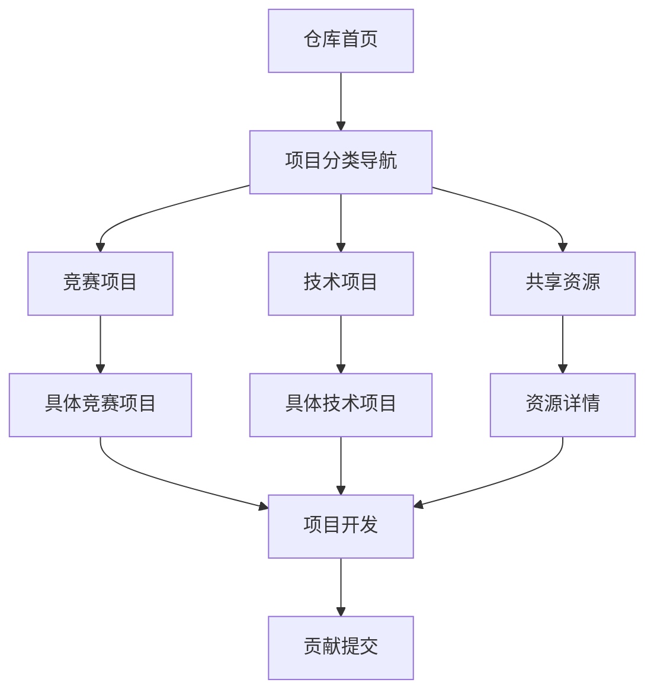

# 仓库目录结构优化产品需求文档 (PRD)

## 1. 产品概述

本项目旨在优化new_energy_coder_club仓库的目录结构，实现所有项目可以一次点击就能打开看到对应目录结构位置，显著提升开发体验与可维护性。通过对标国际基金会优秀开源项目的最佳实践，重新设计符合现代开源项目标准的目录架构，为团队提供更高效的协作环境和更清晰的项目导航体验。

该优化方案将解决当前目录层级过深、项目查找困难、文档分散等问题，建立标准化的项目组织方式，提升项目的专业性和国际化水准。

## 2. 核心功能

### 2.1 用户角色

| 角色 | 注册方式 | 核心权限 |
|------|----------|----------|
| 项目维护者 | GitHub/Gitee账号 | 完整的读写权限，可修改目录结构和项目配置 |
| 开发贡献者 | GitHub/Gitee账号 | 可提交代码、创建分支、提交PR |
| 竞赛参与者 | 团队邀请 | 可访问竞赛相关项目，提交作品和文档 |
| 访客用户 | 无需注册 | 可浏览公开项目、下载资源、查看文档 |

### 2.2 功能模块

我们的仓库目录结构优化需求包含以下主要页面：

1. **根目录导航页面**：项目概览、快速导航、状态面板
2. **分类索引页面**：竞赛项目索引、技术项目索引、资源库索引
3. **项目详情页面**：项目介绍、技术文档、开发指南
4. **资源管理页面**：共享资源、模板库、工具集
5. **贡献指南页面**：开发规范、提交流程、协作指南

### 2.3 页面详情

| 页面名称 | 模块名称 | 功能描述 |
|----------|----------|----------|
| 根目录导航页面 | 项目概览面板 | 显示项目总体状态、活跃度统计、最新动态 |
| 根目录导航页面 | 快速导航菜单 | 提供一键跳转到各主要分类和热门项目 |
| 根目录导航页面 | 状态监控面板 | 实时显示各项目构建状态、测试结果 |
| 分类索引页面 | 竞赛项目列表 | 按年份和类型组织的竞赛项目导航 |
| 分类索引页面 | 技术项目分类 | 按技术领域分类的项目索引和筛选 |
| 分类索引页面 | 搜索过滤器 | 支持关键词、标签、状态的多维度搜索 |
| 项目详情页面 | 项目信息卡片 | 显示项目基本信息、技术栈、贡献者 |
| 项目详情页面 | 文档导航树 | 层级化展示项目文档结构和快速定位 |
| 项目详情页面 | 开发环境配置 | 一键环境搭建、依赖安装、运行指南 |
| 资源管理页面 | 共享资源库 | 图片、模型、文档等资源的分类管理 |
| 资源管理页面 | 模板中心 | 标准化项目模板、代码模板、文档模板 |
| 贡献指南页面 | 开发规范文档 | 代码规范、提交规范、文档规范 |
| 贡献指南页面 | 协作流程图 | 可视化展示从需求到发布的完整流程 |

## 3. 核心流程

### 新用户探索流程
1. 访问根目录 → 查看项目概览 → 选择感兴趣的分类 → 进入具体项目 → 查看开发指南 → 开始贡献

### 开发者贡献流程
1. 克隆仓库 → 查看贡献指南 → 选择项目模板 → 创建分支 → 开发功能 → 提交PR → 代码审查 → 合并发布

### 竞赛团队协作流程
1. 访问竞赛分类 → 选择对应年份和赛事 → 查看项目结构 → 下载模板 → 团队协作开发 → 提交作品



## 4. 用户界面设计

### 4.1 设计风格

- **主色调**：深蓝色 (#1e3a8a) 和新能源绿 (#10b981)
- **辅助色**：灰色系 (#6b7280, #f3f4f6) 和警告橙 (#f59e0b)
- **按钮风格**：圆角矩形，渐变背景，悬停效果
- **字体**：主标题使用 Inter Bold 18-24px，正文使用 Inter Regular 14-16px
- **布局风格**：卡片式设计，响应式网格布局，左侧导航 + 主内容区
- **图标风格**：线性图标，统一使用 Heroicons 或 Feather Icons

### 4.2 页面设计概览

| 页面名称 | 模块名称 | UI元素 |
|----------|----------|--------|
| 根目录导航页面 | 项目概览面板 | 统计卡片，进度条，状态徽章，深蓝色背景渐变 |
| 根目录导航页面 | 快速导航菜单 | 网格布局卡片，图标+文字，悬停放大效果 |
| 分类索引页面 | 项目列表 | 表格视图，标签系统，搜索框，分页器 |
| 项目详情页面 | 信息展示区 | 面包屑导航，标签云，贡献者头像，README渲染 |
| 资源管理页面 | 资源浏览器 | 文件夹树形结构，缩略图预览，下载按钮 |

### 4.3 响应式设计

项目采用移动优先的响应式设计，支持桌面端、平板和移动端访问。桌面端提供完整功能体验，移动端优化触摸交互和单手操作。

## 5. 现状分析与问题识别

### 5.1 当前目录结构问题

基于对现有仓库结构的深入分析，识别出以下关键问题：

**层级过深问题**：
- 当前路径如 `competitions/2025/robocon/2025全国机器人竞赛_ROBOCON/` 需要4-5次点击才能到达
- 中文目录名称在某些系统上存在兼容性问题
- 项目查找路径不直观，新用户学习成本高

**组织方式混乱**：
- 竞赛项目和技术项目混合存放
- 缺乏统一的命名规范
- 项目状态和活跃度不明确

**导航体验差**：
- README文件缺乏有效的快速导航
- 项目间关联关系不清晰
- 搜索和筛选功能缺失

**维护成本高**：
- 新项目添加流程不标准化
- 文档更新容易遗漏
- 缺乏自动化工具支持

### 5.2 国际最佳实践研究

**Apache Foundation项目特点** <mcreference link="https://www.linuxfoundation.org/resources/open-source-guides/starting-an-open-source-project" index="2">2</mcreference>：
- 扁平化目录结构，核心功能直接可达
- 标准化的项目生命周期管理
- 清晰的贡献者指南和治理结构

**CNCF项目组织方式** <mcreference link="https://www.cncf.io/blog/2023/04/03/outlining-the-structure-of-your-open-source-software-project/" index="1">1</mcreference>：
- 按技术领域和成熟度分类
- 强调社区驱动的项目发展
- 完善的文档和示例系统

**Kubernetes项目结构** <mcreference link="https://www.cncf.io/reports/kubernetes-project-journey-report/" index="3">3</mcreference>：
- 多仓库协作模式
- 清晰的SIG（Special Interest Group）组织
- 自动化的CI/CD和文档生成

## 6. 解决方案设计

### 6.1 目录结构重构方案

**设计原则**：
1. **一次点击原则**：核心项目最多2层目录即可访问
2. **语义化命名**：使用英文和标准化命名规范
3. **分类清晰**：按功能和技术领域明确分类
4. **扩展性强**：支持未来项目的灵活添加

**新结构设计**：
```
new_energy_coder_club/
├── 📁 competitions/          # 竞赛项目 (按年份)
│   ├── 2024/
│   └── 2025/
├── 📁 projects/             # 技术项目 (按领域)
│   ├── ai/
│   ├── robotics/
│   ├── embedded/
│   └── research/
├── 📁 shared/               # 共享资源
├── 📁 docs/                 # 文档中心
└── 📁 tools/                # 工具脚本
```

### 6.2 导航系统设计

**多层级导航体系**：
1. **根目录导航**：项目概览 + 快速入口
2. **分类导航**：各领域项目索引
3. **项目导航**：具体项目的内部结构

**智能搜索系统**：
- 支持项目名称、技术栈、年份等多维度搜索
- 提供标签过滤和排序功能
- 集成项目状态和活跃度信息

### 6.3 标准化模板系统

**项目模板标准**：
- AI项目模板：数据处理 + 模型训练 + 部署
- 机器人项目模板：硬件设计 + 控制算法 + 仿真
- 嵌入式项目模板：BSP开发 + 应用层 + 测试

**文档模板规范**：
- README.md：项目介绍 + 快速开始 + 贡献指南
- CHANGELOG.md：版本变更记录
- CONTRIBUTING.md：贡献流程和规范

## 7. 实施计划

### 7.1 第一阶段：准备与设计 (1周)

**任务清单**：
- [ ] 完成现有项目清单和分类
- [ ] 设计新的目录结构和命名规范
- [ ] 制定迁移策略和时间表
- [ ] 准备自动化迁移脚本

**交付物**：
- 项目清单和分类表
- 新目录结构设计文档
- 迁移计划和风险评估

### 7.2 第二阶段：结构迁移 (1-2周)

**迁移步骤**：
1. **创建新目录结构**
   - 建立标准化的目录框架
   - 配置自动化脚本和CI/CD

2. **项目内容迁移**
   - 按优先级迁移核心项目
   - 更新所有内部链接和引用
   - 验证迁移完整性

3. **文档系统重建**
   - 重写主README文件
   - 生成各分类的索引页面
   - 建立项目间的关联导航

**质量保证**：
- 每个迁移步骤都要进行验证测试
- 保持原有Git历史记录
- 建立回滚机制

### 7.3 第三阶段：优化与完善 (1周)

**优化内容**：
- 性能优化：页面加载速度、搜索响应时间
- 用户体验：导航流畅性、移动端适配
- 自动化工具：CI/CD集成、文档自动生成

**测试验证**：
- 功能测试：所有导航链接有效性
- 性能测试：页面加载时间 < 2秒
- 兼容性测试：多平台、多浏览器支持

## 8. 风险评估与应对

### 8.1 技术风险

**风险**：迁移过程中可能出现链接失效或文件丢失
**应对**：
- 建立完整的备份机制
- 分阶段迁移，每步验证
- 准备快速回滚方案

### 8.2 用户体验风险

**风险**：现有用户可能不适应新的目录结构
**应对**：
- 提供详细的迁移说明文档
- 建立新旧结构的映射关系
- 设置过渡期和重定向机制

### 8.3 维护风险

**风险**：新结构可能增加维护复杂度
**应对**：
- 开发自动化维护工具
- 建立标准化的操作流程
- 提供详细的维护文档

## 9. 成功指标

### 9.1 用户体验指标
- 项目查找时间减少 70%（从平均5次点击降至2次）
- 新用户上手时间减少 50%
- 用户满意度评分 > 4.5/5.0

### 9.2 技术指标
- 页面加载时间 < 2秒
- 导航链接有效率 100%
- 移动端兼容性 > 95%

### 9.3 维护效率指标
- 新项目添加时间减少 60%
- 文档更新自动化率 > 80%
- 结构验证自动化覆盖率 100%

## 10. 后续发展规划

### 10.1 短期目标 (3个月)
- 完成所有现有项目的结构优化
- 建立完善的自动化工具链
- 形成标准化的项目管理流程

### 10.2 中期目标 (6个月)
- 集成智能搜索和推荐系统
- 建立项目质量评估体系
- 开发可视化的项目管理界面

### 10.3 长期目标 (1年)
- 成为高校开源项目的标杆案例
- 建立开源社区生态系统
- 推广到其他类似项目和组织