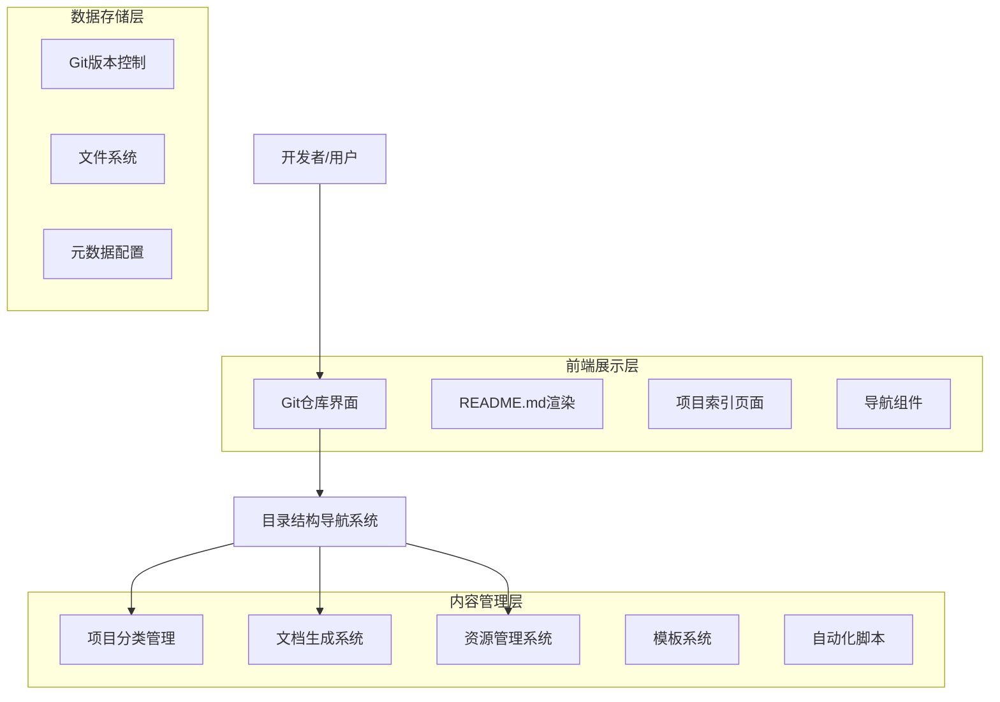

# 仓库目录结构优化技术架构文档

## 1. 架构设计



## 2. 技术描述

- **前端**: Markdown + GitHub/Gitee Pages + 静态站点生成
- **后端**: Git版本控制系统 + Shell/Python自动化脚本
- **文档系统**: Markdown + MkDocs/VitePress
- **CI/CD**: GitHub Actions / Gitee Go

## 3. 路由定义

| 路由 | 用途 |
|------|------|
| / | 仓库根目录，主导航页面 |
| /competitions/ | 竞赛项目分类索引 |
| /competitions/{year}/ | 特定年份竞赛项目列表 |
| /competitions/{year}/{competition}/ | 具体竞赛项目详情 |
| /projects/ | 技术项目分类索引 |
| /projects/{category}/ | 特定技术领域项目列表 |
| /projects/{category}/{project}/ | 具体技术项目详情 |
| /shared/ | 共享资源库 |
| /shared/images/ | 图片资源库 |
| /shared/models/ | 3D模型资源库 |
| /templates/ | 项目模板库 |
| /docs/ | 文档中心 |

## 4. 目录结构设计

### 4.1 优化后的目录结构

```
new_energy_coder_club/
├── README.md                    # 主导航页面
├── CONTRIBUTING.md              # 贡献指南
├── LICENSE.md                   # 开源协议
├── .github/                     # GitHub配置
│   ├── workflows/               # CI/CD工作流
│   ├── ISSUE_TEMPLATE/          # Issue模板
│   └── PULL_REQUEST_TEMPLATE.md # PR模板
├── docs/                        # 文档中心
│   ├── index.md                 # 文档首页
│   ├── getting-started/         # 快速开始指南
│   ├── development/             # 开发指南
│   ├── deployment/              # 部署指南
│   └── api/                     # API文档
├── competitions/                # 竞赛项目 (按年份组织)
│   ├── README.md                # 竞赛项目总览
│   ├── 2024/
│   │   ├── README.md            # 2024年竞赛概览
│   │   ├── robocon/             # 机器人竞赛
│   │   ├── smart-car/           # 智能车竞赛
│   │   ├── iot-design/          # 物联网设计竞赛
│   │   ├── electronics/         # 电子设计竞赛
│   │   └── energy-saving/       # 节能减排竞赛
│   └── 2025/
│       ├── README.md            # 2025年竞赛概览
│       ├── robocon/             # 机器人竞赛
│       ├── traffic-design/      # 交通设计竞赛
│       └── energy-saving/       # 节能减排竞赛
├── projects/                    # 技术项目 (按领域组织)
│   ├── README.md                # 技术项目总览
│   ├── ai/                      # 人工智能项目
│   │   ├── README.md            # AI项目概览
│   │   └── energy-monitoring/   # 能源监测系统
│   ├── robotics/                # 机器人项目
│   │   ├── README.md            # 机器人项目概览
│   │   ├── humanoid-robot/      # 人形机器人
│   │   └── flight-control/      # 飞行控制系统
│   ├── embedded/                # 嵌入式项目
│   │   ├── README.md            # 嵌入式项目概览
│   │   └── nearlink/            # 星闪技术
│   ├── research/                # 科研项目
│   │   ├── README.md            # 科研项目概览
│   │   ├── dexterous-hand/      # 灵巧手项目
│   │   ├── pneumatic-system/    # 气缸控制系统
│   │   ├── 3d-printing/         # 3D打印项目
│   │   └── mica-validation/     # MICA验证项目
│   └── templates/               # 项目模板
│       ├── README.md            # 模板使用指南
│       ├── ai-template/         # AI项目模板
│       ├── robotics-template/   # 机器人项目模板
│       └── embedded-template/   # 嵌入式项目模板
├── shared/                      # 共享资源
│   ├── README.md                # 资源库说明
│   ├── assets/                  # 静态资源
│   │   ├── images/              # 图片资源
│   │   ├── videos/              # 视频资源
│   │   └── documents/           # 文档资源
│   ├── models/                  # 3D模型文件
│   ├── libraries/               # 代码库
│   └── tools/                   # 工具脚本
├── scripts/                     # 自动化脚本
│   ├── setup.sh                 # 环境搭建脚本
│   ├── build.py                 # 构建脚本
│   └── deploy.sh                # 部署脚本
└── config/                      # 配置文件
    ├── project.json             # 项目配置
    ├── navigation.yml           # 导航配置
    └── templates.yml            # 模板配置
```

### 4.2 标准化项目结构模板

每个项目目录应包含以下标准文件：

```
project-name/
├── README.md                    # 项目说明文档
├── CHANGELOG.md                 # 变更日志
├── docs/                        # 项目文档
│   ├── setup.md                 # 环境搭建
│   ├── usage.md                 # 使用指南
│   └── api.md                   # API文档
├── src/                         # 源代码
├── tests/                       # 测试代码
├── assets/                      # 项目资源
├── config/                      # 配置文件
└── scripts/                     # 项目脚本
```

## 5. 自动化工具设计

### 5.1 目录结构生成器

```python
# scripts/generate_structure.py
def generate_project_structure():
    """自动生成项目目录结构和README文件"""
    pass

def update_navigation():
    """更新导航配置文件"""
    pass

def validate_structure():
    """验证目录结构完整性"""
    pass
```

### 5.2 文档同步工具

```python
# scripts/sync_docs.py
def sync_readme_files():
    """同步所有README文件的导航链接"""
    pass

def generate_index_pages():
    """生成分类索引页面"""
    pass

def update_project_status():
    """更新项目状态信息"""
    pass
```

## 6. 实施计划

### 6.1 第一阶段：结构重组 (1-2周)
1. 创建新的目录结构
2. 迁移现有项目到新结构
3. 更新所有README文件
4. 建立标准化模板

### 6.2 第二阶段：工具开发 (1周)
1. 开发自动化脚本
2. 配置CI/CD流程
3. 建立文档生成系统

### 6.3 第三阶段：优化完善 (1周)
1. 性能优化
2. 用户体验改进
3. 文档完善
4. 测试验证

## 7. 验收标准

### 7.1 功能验收
- [ ] 所有项目可通过一次点击访问
- [ ] 目录结构清晰，层级不超过3层
- [ ] 导航链接100%有效
- [ ] 搜索功能正常工作

### 7.2 性能验收
- [ ] 页面加载时间 < 2秒
- [ ] 移动端适配良好
- [ ] 支持离线浏览

### 7.3 维护性验收
- [ ] 新项目添加流程标准化
- [ ] 文档自动同步
- [ ] 结构验证自动化
- [ ] 贡献流程清晰明确