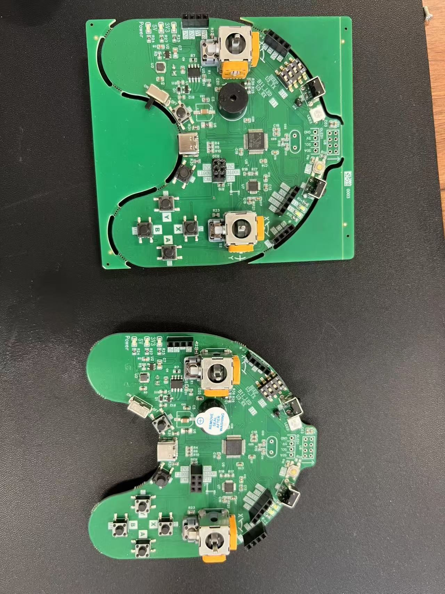

# 星闪手柄（NearLink Gamepad）

> 状态：🟢 活跃 ｜ 技术栈：**RISC-V WS63/WS63E** / 星闪 SLE / LiteOS / openEuler Embedded
> 基于 NearLink_DK_WS63 星闪开发板制作的遥控手柄，通过星闪 SLE 无缝控制集成 WS73 的智能小车（小车端兼容 openEuler 与 ROS 2）。
> 本项目为 **OSPP 2024「基于 openEuler Embedded 的星闪开源应用案例开发」** 的社区实践项目（@吴洛斌 2025-03-10 测试验证）。

## 项目概览

| 项 | 内容 |
|---|---|
| 主控 | 海思 WS63/WS63E（RISC-V 内核，Wi-Fi 6 + 星闪 SLE + 蓝牙多模） |
| 开发板 | HiHope NearLink_DK_WS63E / BearPi-Pico_H3863（小熊派） |
| 被控端 | WS73 星闪小车（EulerCar，兼容 openEuler / ROS 2） |
| 自研硬件 | 遥控器 PCB（原理图 + Gerber + Keil5 工程，见 `相关资料/`） |
| 核心固件 | `sle_ospp_server.c`（星闪 SLE 服务端，位于 OSPP 上游仓库，见下） |

## 手柄操作

1. 左摇杆：控制 EulerCar 前进、后退、左转、右转
2. 右摇杆：控制 EulerCar 夹爪张开、闭合
3. 左右扭子开关：切换不同 EulerCar 小车

## 快速上手

1. **获取 SDK**：`git clone https://gitee.com/HiSpark/fbb_ws63.git`（SDK 不入本仓）
2. **环境搭建**：按上游 [tools 目录 README](https://gitee.com/HiSpark/fbb_ws63/tree/master/tools)；本仓 `相关资料/开发WB63编译环境搭建.pdf` 有中文补充
3. **烧录**：Type-C 连接，安装 CH341SER 驱动后用烧录工具烧录（部分板子需插拔后才能烧录成功，见 [log.md](./log.md) 排障记录）
4. **组网**：小车端配置组网与域 ID，手柄即可配对控制

完整开发指引 → [WS63 星闪开发指南](../../docs/learn/riscv-ai/ws63-nearlink-guide.md)

## 本仓资料

| 文件 | 说明 |
|---|---|
| `相关资料/开发WB63编译环境搭建.pdf` | 编译环境搭建中文教程 |
| `相关资料/BearPi-EBM_H63.pdf`、`BearPi-H3863_Pico.pdf` | 小熊派官方板卡文档 |
| `相关资料/SCH_Schematic1_2025-05-18.pdf` | 自研遥控器原理图 |
| `相关资料/Gerber_PCB1_2025-04-09.zip` | 自研遥控器 PCB 制板文件 |
| `相关资料/J20RC_BaseTransmitter_V2.1_Keil5Project.zip` | 遥控器 Keil5 工程 |
| `image/` | 实操与成品照片 |
| [log.md](./log.md) | 成员开发日志（环境搭建/烧录/焊接/调试排障记录） |

## 参考资料（上游项目，版权归原作者所有）

本项目建立在以下上游开源项目之上，正文不再搬运其文档，请直接访问上游：

1. **fbb_ws63 SDK**（[gitee.com/HiSpark/fbb_ws63](https://gitee.com/HiSpark/fbb_ws63)）
   WS63/WS63E 官方开源 SDK：购买渠道、支持开发板（NearLink_DK_WS63E / BearPi-Pico_H3863 等）、外设示例（I2C/SPI/UART/PWM）与板级 demo（OLED、AHT20 温湿度、陀螺仪）。
2. **OSPP 星闪手柄项目**（[gitee.com/AbrillantLee/yocto-embedded-tools](https://gitee.com/AbrillantLee/yocto-embedded-tools)，`hi-sle` 分支）
   「基于 openEuler Embedded 的星闪开源应用案例开发」：星闪手柄完整方案，含 WS63 主控 / EulerPi（海鸥派）/ Hi3061M 三端固件、`sle_ospp_server.c` 控制核心、硬件电路设计、PCB layout、结构建模、焊接与总装指南。本项目的硬件与固件方案主要参考/复用该上游。

## 星闪手柄实操展示

## 贡献与联系

- Issues：主仓库 Issues 区（标签 `area:embedded`）
- 新成员开发请先读 [log.md](./log.md) 的排障记录，可少踩 80% 的坑
