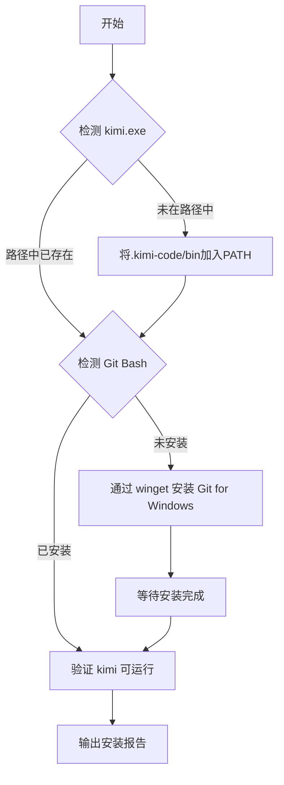

# Kimi Env Setup — Kimi CLI 初始环境自动搭建

> 在全新的 Windows 系统上，一键完成 Kimi CLI 运行环境的检测、安装与配置。

## 问题场景

在 Windows 新机上首次运行 `kimi` 时，通常会遇到两个典型错误：

**错误 1 — 命令未找到：**
```
kimi : 无法将"kimi"项识别为 cmdlet、函数、脚本文件或可运行程序的名称。
```

**错误 2 — Git Bash 未找到：**
```
error: Git Bash not found
```

本 Skill 自动检测并修复这两个问题。

## 前置条件

- Windows 10 / 11 系统
- Kimi CLI 已安装（默认位置 `%USERPROFILE%\.kimi-code\bin\kimi.exe`）
- PowerShell 5.1+（Windows 自带）
- 网络连接（用于 winget 安装 Git for Windows）

## 工作流程



### Step-by-Step

| 步骤 | 操作 | 说明 |
|------|------|------|
| 1 | 检测 `kimi.exe` 位置 | 搜索 PATH 及默认安装目录 |
| 2 | 添加 PATH | 如不在 PATH 中，添加到用户环境变量 |
| 3 | 检测 Git Bash | 检查 6 个已知 Git 安装路径下的 `bash.exe` |
| 4 | 安装 Git for Windows | 用 `winget` 自动安装（如缺失） |
| 5 | 配置 PATH 刷新 | 为当前会话加载新 PATH |
| 6 | 验证 `kimi` 命令 | 运行 `kimi --version` 确认正常 |

## 脚本调用方式

### 一键安装（推荐）

```powershell
# 在 PowerShell 中直接运行 setup 脚本
& "$env:USERPROFILE\.kimi-code\bin\kimi.exe" --print --final-message -p "请执行 kimi-env-setup 技能"
```

或直接运行脚本：

```powershell
# 项目目录中执行
powershell -ExecutionPolicy Bypass -File ./scripts/setup.ps1
```

### 手动逐步执行（选读）

如果希望分步理解每个环节，也可以手动执行以下命令：

```powershell
# 步骤 1：添加 PATH
$kimiDir = "$env:USERPROFILE\.kimi-code\bin"
if ($env:Path -notlike "*$kimiDir*") {
  [Environment]::SetEnvironmentVariable('Path',
    [Environment]::GetEnvironmentVariable('Path','User') + ";$kimiDir", 'User')
  $env:Path += ";$kimiDir"
  Write-Host "✅ 已将 $kimiDir 加入 PATH"
}

# 步骤 2：安装 Git（如缺失）
$gitPaths = @(
  "C:\Program Files\Git\bin\bash.exe",
  "C:\Program Files (x86)\Git\bin\bash.exe",
  "$env:LOCALAPPDATA\Programs\Git\bin\bash.exe"
)
$found = $false
foreach ($p in $gitPaths) { if (Test-Path $p) { $found = $true; break } }
if (-not $found) {
  Write-Host "⏳ 正在安装 Git for Windows..."
  winget install --id Git.Git -e --source winget --accept-package-agreements --accept-source-agreements
}

# 步骤 3：验证
kimi --version
```

## 执行规则

1. **幂等性**：脚本可重复执行，不会重复添加 PATH 或重复安装 Git
2. **不破坏已有配置**：仅修改缺失的项目，不覆盖用户已有环境变量
3. **安全执行**：安装 Git 使用 `winget` 官方源，不引入第三方软件
4. **清晰反馈**：每一步输出 `✅/❌/⏳` 状态标记

## 验证清单

执行完成后，逐一检查以下项目：

| 检查项 | 预期结果 | 验证命令 |
|--------|---------|---------|
| PATH 中存在 kimi | `kimi` 命令可用 | `where kimi` |
| Git Bash 已安装 | bash.exe 可访问 | `& "C:\Program Files\Git\bin\bash.exe" --version` |
| Kimi CLI 可运行 | 输出版本号 | `kimi --version` |
| PATH 环境变量持久化 | 重启终端后仍有效 | 重新打开 PowerShell 运行 `kimi --version` |

## 常见问题

### Q: winget 安装 Git 失败或速度慢

从 https://gitforwindows.org/ 手动下载安装，然后重新运行脚本。

### Q: Kimi CLI 本身未安装

```powershell
# 从 Moonshot AI 官方渠道安装 Kimi CLI
npm install -g kimi-cli
# 或下载 Kimi Desktop：https://kimi.moonshot.cn/desktop
```

### Q: 安装后当前会话仍找不到 kimi

```powershell
# 手动刷新当前会话的 PATH
$env:Path = [Environment]::GetEnvironmentVariable('Path','User') + ';' + [Environment]::GetEnvironmentVariable('Path','Machine')
```

### Q: 需要自定义 bash.exe 路径

```powershell
# 设置 KIMI_SHELL_PATH 环境变量指向自定义 bash
[Environment]::SetEnvironmentVariable('KIMI_SHELL_PATH', 'D:\path\to\bash.exe', 'User')
```

## 参考资料

- [Kimi CLI 官方文档](https://kimi.moonshot.cn/)
- [Git for Windows 下载](https://gitforwindows.org/)
- [PowerShell 环境变量设置](https://learn.microsoft.com/zh-cn/powershell/module/microsoft.powershell.core/about/about_environment_variables)
